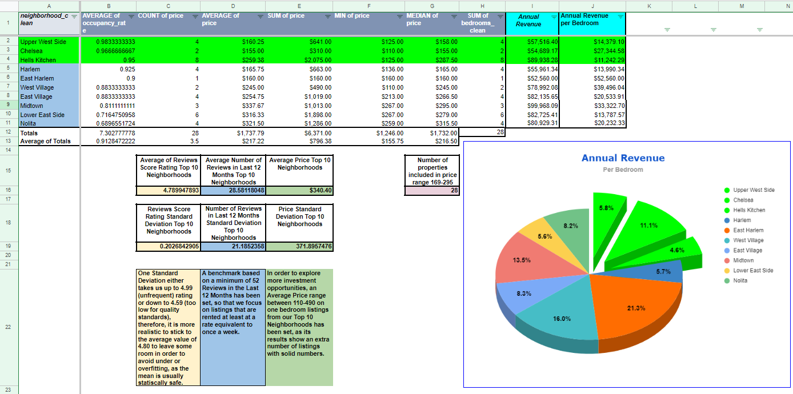
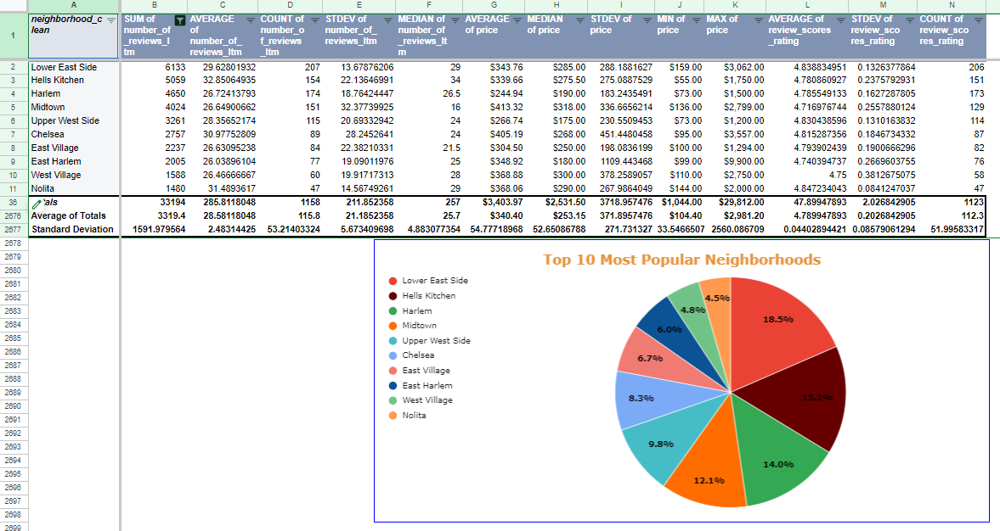
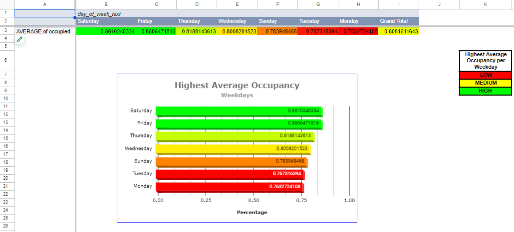
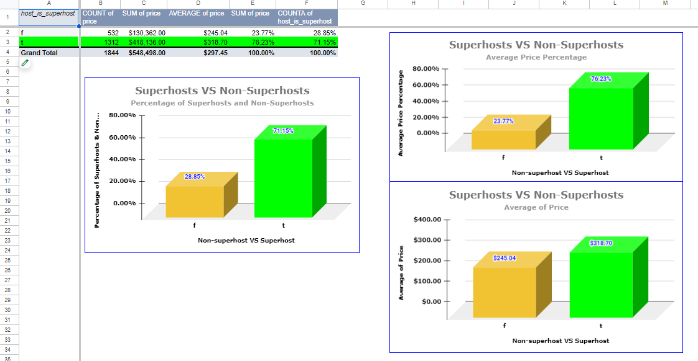

## NYC Airbnb: Annual Revenue & Rate of Occupancy Analysis

## Introduction:

-The Manhattan borough of New York City was analyzed throughly using the data provided in this dataset, with the main purpose to find solid data on listings that make them great candidates for investments in the area. More specifically, the questions raised were: What types of properties should an investor be targeting in this area?, What trends and patterns can be found in the data?, Are there any characteristics that make the listings more appealing to clients? 

## Process: 

-Throughout this analysis several variables were considered, such as: Rate of occupancy, review scores ratings, location, activity in the last 12 months, a minimum night requirement benchmark of 7 days or less and an estimate of annual revenue per listing. 
-As the analysis developed, a Top 10 of the Most Popular Neighborhoods in the area was generated, on which further analysis was based upon.  
-An ideal Number of Bedrooms offered was also calculated and the Highest Average Occupancy by Weekdays was determined. 
-Superhost and instant bookings accounts were compared with their opposites, listings that offered the service of a "Doorman" were also compared with the ones that did not offer that service and a correlation between high review scores and average prices was searched. 

## Content

This dataset contains 2 tables: Listings and Calendar. Calendar is the largest table, as it contains 72,553 rows.  

The Google Sheets Document contains the following Table of Contents:

-Start Here  
-data_dictionary  
-Raw Data (listings)  
-Raw Data (calendar)  
-Processed listings  
-Processed calendar  
-Top 10 Most Popular Neighborhoods  
-Most Popular Number of Bedrooms  
-Most Pop # of Bedrooms for Top 10 Neighborhoods  
-Average Occupancy, SD & Median for Each Listing  
-Average Occupancy by Weekday  
-Weekdays With Highest Average Occupancy  
-Maximum and Minimum Prices of Top 10 Neighborhoods  
-Annual Revenue Top 10 Neighborhoods  
-Annual Revenue Top 10 Neighborhoods (Wider Avg Pr)  
-Superhost VS Non-Superhost  
-Instant Bookings Occupancy Rates  
-Average of Review Scores at Check-in with Doorman  
-Correlation Between High Review Scores and Average Prices  

## Conclusion and Recommendations:

-Based on the results, the vacation ideal, one-bedroom properties located in the Chelsea, Upper West Side and Harlem Neighborhoods, are the ones with the most solid numbers to backup investment, as they all hold an above 96% of occupancy rate in the last 12 months, with a $199.00 average price and an average Annual Revenue of $71,024.95 per each listing.   

-It is also recommended to take into consideration a wider average price range ($110-$490) to explore more listings that could also be good candidates for investment in the area. These listings hold a solid 95% and above average of occupancy rate in the last 12 months, with a $191.54 average price and an average Annual Revenue of $67,381.28 per each listing, as it is shown on the ""Annual Revenue Top 10 Neighborhoods (Wider Avg Pr). 

-The main focus of advertising should be on Thursdays, Fridays and Saturdays. A package deal could be created for a special price or offer in order to take full advantage of the higher demand for these 3 weekdays.

-The data shows that superhosts tend to charge $73.66 more than non-superhosts and there are 3.2 times more superhosts than non-superhosts (76.23% vs 23.77%), as a result, it is viable to consider investing as a priority in superhosts listings.  

-With a 6.06% difference in occupancy rate, it is assumed that instant bookable listings are slightly more popular than non-instant bookable listings. We should definitely consider reviewing back the data on non-instant bookable listings in the near future (or research other available datasets) as they seem to show a pattern of preference amongst clients.

## Link to Report:

https://docs.google.com/spreadsheets/d/1CZBgfRgvZwWgDAKBp3WXUPOn6lG9mkLgoVDCNE3kAPU/edit?usp=sharing

## Project Files

-README.md 
-nyc_airbnb_data_06-20-24_v5.1.xlsx 
-images

## Author

Saul Solis
