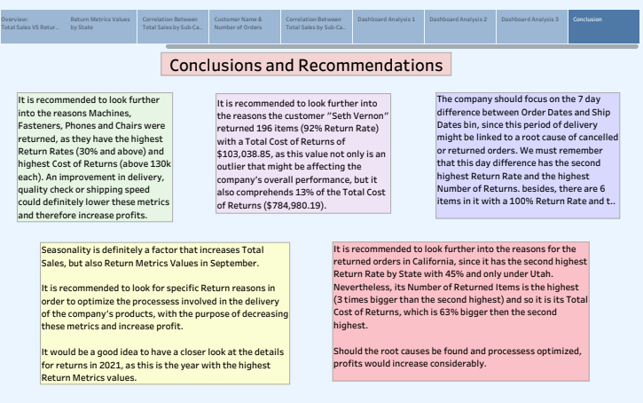

## Superstore: Return Metrics Analysis

## Introduction:

At the end of this presentation, you will be able to use three fundamental metrics for
Return Analysis on the Superstore data. You will be able to filter out and/or
pre-determine parameters for grouping, analyzing and displaying different results,
in order to obtain insights out of the data.

## Process: 

A left Join was performed on the Returns table as its information was necessary for the calculation of relevant metrics.  

Throughout the analysis, the following was found:  

-Customers with the highest Return Metric Values. 
-Locations with the highest Return Metric Values. 
-Products with the highest Return Metric Values. 
-Products Sub-Categories with the highest Return Metric Values. 
-Weekdays and Months with the highest Return Metric Values. 
-Order & Ship Dates Days difference with the highest Return Metrics Values. 

## Content

This dataset contains 3 tables: Orders, People and Returns. Orders is the main source of information for this analysis projects, as it contains 27 columns and 12420 rows.  

The workbook contains the following sheets along with descriptions and findings on their captions:  

-Data Source 
-Total Sales & Total Return Metrics Values 
-Return Metrics by State 
-Correlation Between Total Sales by Sub-Category 
-Product Category 
-Customer & Number of Orders 
-State & City 
-Month & Year 
-Count of Orders by Sub-Category 
-Count of Orders by Weekday 
-Correlation Between Total Sales by Sub-Category, State, Region  
-Customer Name & Number of Orders 
-Sub-Category 
-Order & Ship Dates Days Difference 
-Order & Ship Dates Days Difference by Ship Mode 
-Order & Ship Dates Days Difference By Product, Category & Region 

The workbook also contains the following dashboards and Stories for comparative analysis purposes:

-Dashboard Analysis 1 

-Dashboard Analysis 2 

-Dashboard Analysis 3 

-Logo 

-Story 

## Conclusions and Recommendations:

## Tableau Public Link

https://public.tableau.com/views/FinalProjectStoryTelling_17227402019950/Story?:language=en-US&publish=yes&:sid=&:redirect=auth&:display_count=n&:origin=viz_share_link

## Project Files

-README.md 
-FinalProjectStoryTelling.twbx 
-FinalProjectStoryTelling.twb 
-FinalProjectStoryTelling.pdf 
-Superstore.xls 
-SuperstoreLogo.png 
-images

## Author

Saul Solis
