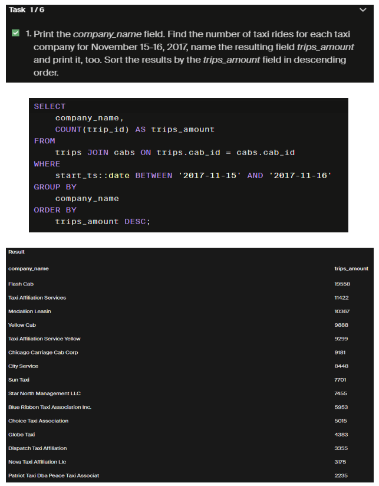
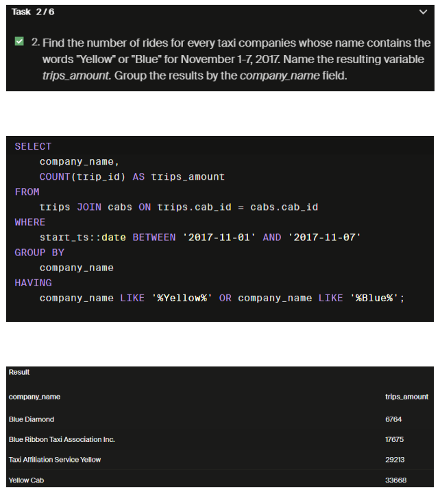
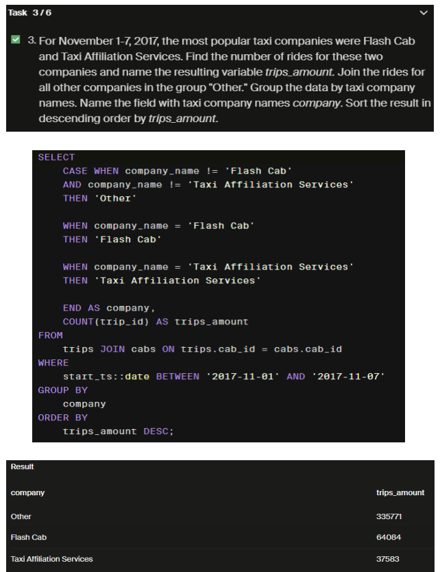
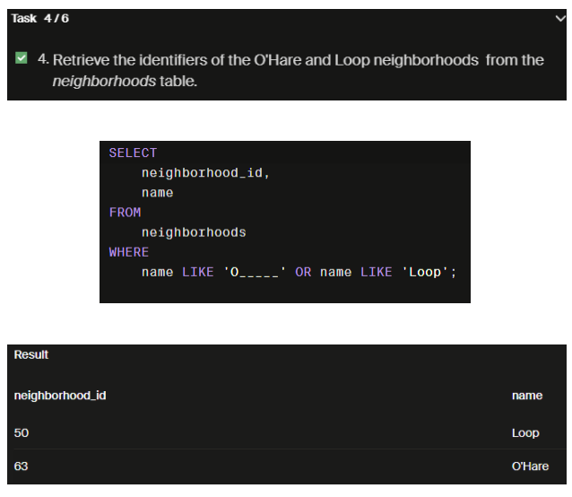
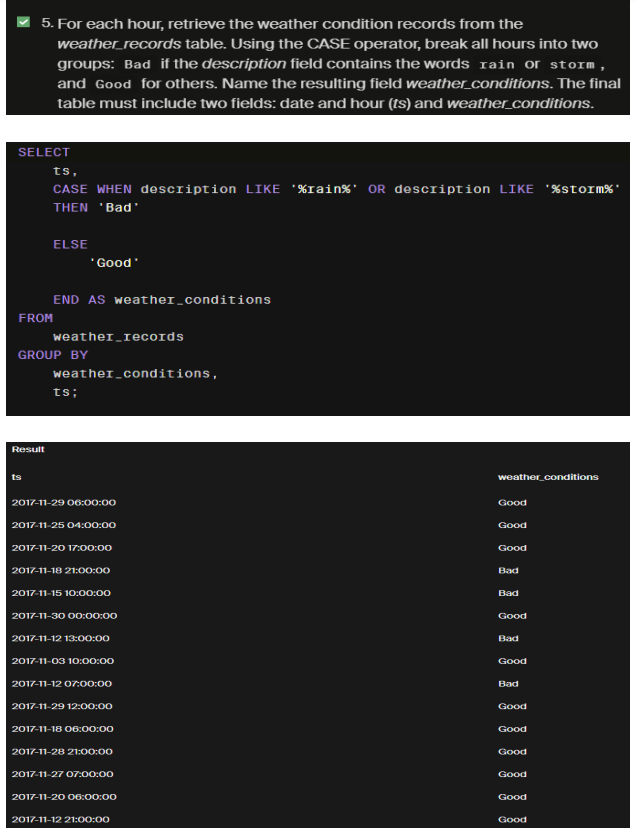
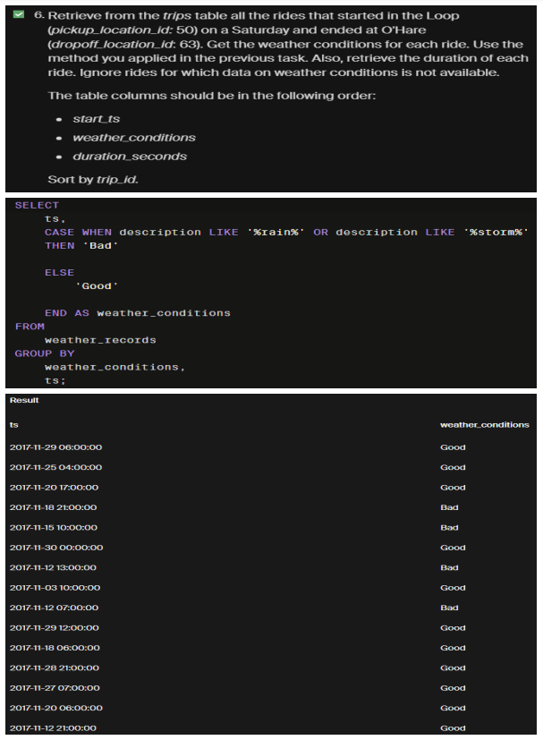
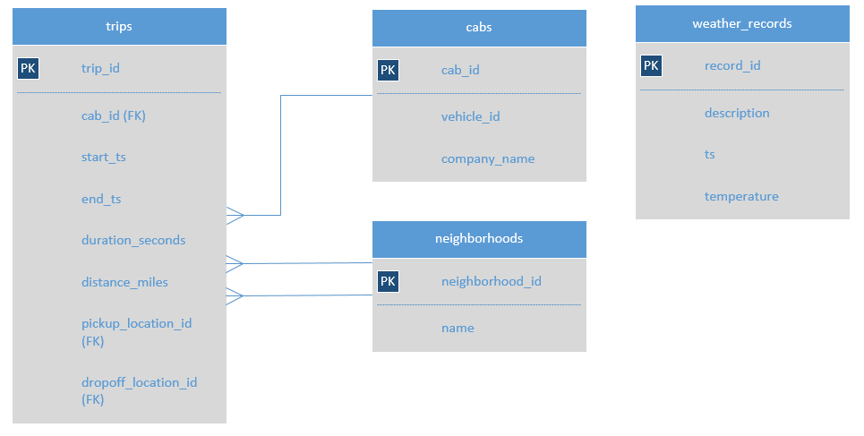

## The Zuber Database: Data Exploration

## Introduction:

Zuber is a new ride-sharing company that's launching in Chicago. The main goal of this analysis is to find patterns in the available information. It is necessary to understand passenger preferences and the impact of external factors on rides, by analyzing data from competitors and investigate the impact of weather on ride frequency.  

This dataset is located on the Tripleten online teaching platform and it contains 4 tables: Neighborhoods, Cabs, Trips and Weather_records. Trips is the largest table, as it contains 1,691,670 rows.

## Process
Data exploration tasks:

 

 

 

 

 

The table columns should be in the following order: 

## Content

### Tables:
neighborhoods table: data on city neighborhoods  
name: name of the neighborhood  
neighborhood_id: neighborhood code  

### cabs table: data on taxis
cab_id: vehicle code  
vehicle_id: the vehicle's technical ID  
company_name: the company that owns the vehicle  

### trips table: data on rides
trip_id: ride code  
cab_id: code of the vehicle operating the ride  
start_ts: date and time of the beginning of the ride (time rounded to the hour)  
end_ts: date and time of the end of the ride (time rounded to the hour)  
duration_seconds: ride duration in seconds  
distance_miles: ride distance in miles  
pickup_location_id: pickup neighborhood code  
dropoff_location_id: dropoff neighborhood code  

### weather_records table: data on weather
record_id: weather record code  
ts: record date and time (time rounded to the hour)  
temperature: temperature when the record was taken  
description: brief description of weather conditions, e.g. "light rain" or "scattered clouds"  

Data Modeling:

## Conclusion and Recommendations:

- There are 6 Cab companies over 9,000 trips each in 2 days. It is recommended to focus on how those companies offer their services, the number and state of their units and the type of service of their drivers, 
in order to establish best practices for all companies.  

- From November 1-7th, Flash Cab and Taxi Affiliation Services made more trips than all of the trips made by all other companies. In fact, Flash Cab made almost twice as many. Further analysis of the characteristics mentioed above should be performed on these two.

## Link to Report:

https://drive.google.com/file/d/11WPsahG1b0mh0C2gqZ8mqQ4o-XktMhGu/view?usp=sharing

## Project Files

-README.md 
-The Zuber Database Data Exploration.pdf 
-DataModel.png 
-images

## Author

Saul Solis
