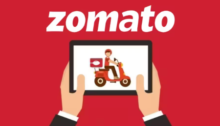
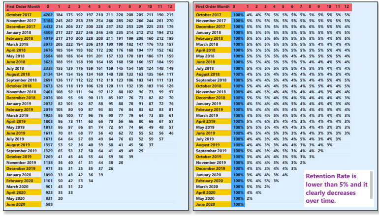
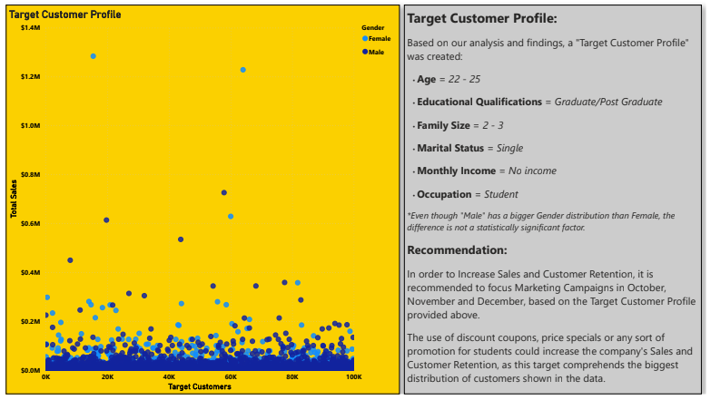
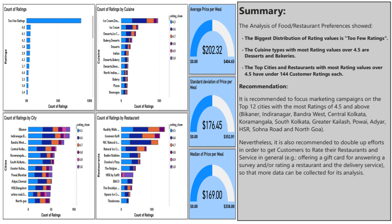
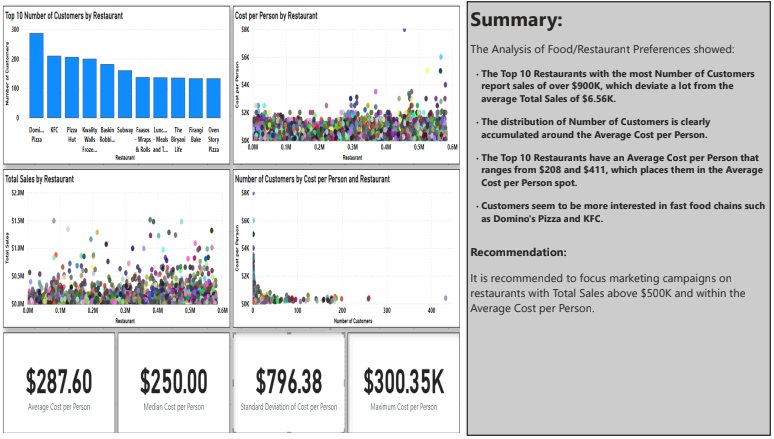

## Zomato: Customer Segmentation Analysis

## Introduction: 

From what can be seen from the information on the tables and after running a few totals and averages, it seems that sales are influenced by the type of food customers consume and the location of the venues. Nevertheless, we will of course get a much clearer picture of what is really happening with our data after creating visualizations of combined variables and characteristics (such as: Age, Gender, Monthly Income, Education Level, etc).  

It will be necessary to create new tables and columns with clean and filtered information and or calculations. Furthermore, it should be considered that certain variables be converted into categorical in order to find out if that conversion could prove useful to our analysis.  

## Process: 

-Power BI automatically joined the food-menu, orders-users tables as a Many to 1 relationship (*:1) on their row ID column and their user_id respectively.  
-Power BI automatically joined the menu-restaurant, menu-users tables as a 1 to 1 relationship (1:1) on their row ID column.  
-A new table called count_of_orders_quantities was created as a Many to 1 relationship (*:1) with the orders table.  
-A new table called orders_by_unique_customers was created as a 1 to 1 relationship (1:1) with the users table.  
-A new table called sales_by_customer was created as a 1 to 1 relationship (1:1) with the users table.  
-A new table called cohort_analysis_months was created in order to perform calculations for retention rates. There is no necessary relation with other tables.  
-A new column called price_clean was created in the menu table, in order to replace all blank rows with the average price per meal.  
-A new column called first_order_end_of_month was created in the orders table, in order to obtain the unique customers' first order date and convert it to the end of the month date.  
-A new column called cost_processed was created in the restaurant table, in order to replace all non-numerical signs from values.  
-A new column called cost_clean was created in the restaurant table, in order to replace all blank rows with the average cost per customer.  
-A new column called url_names was created in the restaurant table, in order to extract all restaurant names from the link column.  
-A new column called name_clean was created in the restaurant table, in order to replace all blank rows with the names of the restaurants extracted from the url_names column.  
-A new column called rating_clean was created in the restaurant table, in order to replace all blank rows with "No Rating".  
-A new column called rating_count_clean was created in the restaurant table, in order to replace all blank rows with "No Rating".  

## Content

This dataset originally contains 5 tables: Orders, Menu, Restaurant, Users and Food. Menu is the largest table, as it contains 1,179.936 rows.  

The workbook contains the following sheets along with descriptions and findings on their captions:

-Data Source 
-Sales/Sales Quantity by Customer 
-Sales Summary 
-Number of Orders/Quantity per Order by Customer 
-Orders Summary 
-Customers by Age, Gender and Monthly Income 
-Customers Summary 1 
-Customers by Family Size, Marital Status and Monthly Income 
-Customers Summary 2 
-Customer by Education Level, Occupation and Monthly Income 
-Customers Summary 3 
-Customer Distribution Over Time 
-Number of Customers Over Time Summary 
-Cohort Analysis and Retention Rate 
-Customer Food/Restaurant Preferences 
-Food/Restaurant Preferences Summary 
-Ratings, Cities and Cuisine 
-Ratings, Cities and Cuisine Summary 
-Target Customer 

## Conclusion and Recommendations: 

### Throughout the analysis, the following was found:

-Retention Rates are lower than 10%. 
 
  
 
-A Target Customer Profile to improve sales and Retention Rates. 
 
  
 
-Top 12 Cities to run marketing campaigns on. 
 
  
 
-"Too Few Ratings" holds the majority of the distribution of Ratings. 
 
  
 
-Marketing Campaigns could have better results on Restaurants with Total Sales Average above $500K and within the Average Cost per Person. 
 
 
 

## Power BI Service Link

https://app.powerbi.com/groups/me/reports/cb6485df-1720-48c2-9975-d665aba1e909/1af928add86a0eb010b8?experience=power-bi

## Project Files

-README.md 
-ZomatoCustomerSegmentationAnalysisPresentation.pdf 
-Zomato_data 
-images

## Due to the size of .pbix files, you will have to use the link above to have access to the file.
-ZomatoCustomerSegmentationAnalysis.pbix 

## Author

Saul Solis
